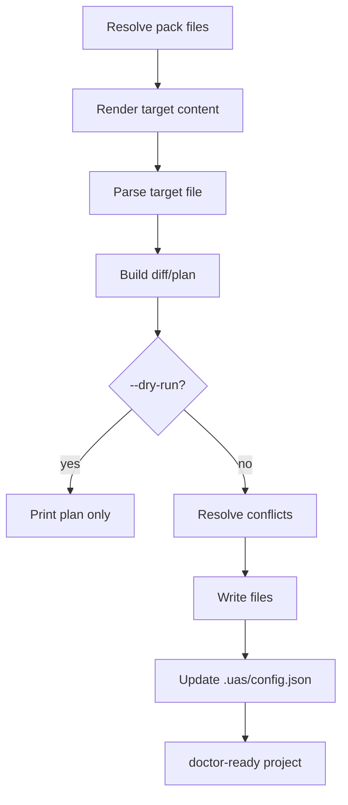

# Generated File Adapter and Merge Specification

Date: 2026-06-24  
Status: Draft for implementation  
Owner: Universal AI Skills Toolkit

## 1. Overview

The generated file adapter converts registry packs into local project files and safely merges them into existing projects.

This is the core engine behind the MVP "aha moment": running `uas add ...` should create useful files such as `.cursor/rules/*.mdc`, `AGENTS.md`, and GitHub templates without silently damaging existing project content.

## 2. Goals

- Generate real local files in MVP.
- Protect existing user files through marker blocks and interactive conflict handling.
- Support future update and remove flows through ownership records.
- Keep local diffing and merge decisions inside the CLI.
- Provide predictable behavior for `--dry-run` and `--yes`.

## 3. Generation Targets

MVP targets:

| Target family | Paths |
| --- | --- |
| Global agents | `AGENTS.md`, `CLAUDE.md`, `GEMINI.md` |
| Cursor | `.cursor/rules/*.mdc` |
| Claude | `.claude/skills/<slug>/SKILL.md` and related package files |
| Codex | `.codex/skills/<slug>/SKILL.md` and related package files |
| GitHub | `.github/workflows/*.yml`, `.github/PULL_REQUEST_TEMPLATE.md`, `.github/ISSUE_TEMPLATE/*.md`, `.github/CODEOWNERS` |
| UAS state | `.uas/config.json` |
| Manual docs | `docs/*manual*.md` for steps the CLI must not enforce through APIs |

## 4. Adapter Types

| Adapter | Input | Output |
| --- | --- | --- |
| `markdown-instruction` | Localized markdown or policy rules. | Managed sections in `AGENTS.md`, `CLAUDE.md`, `GEMINI.md`, or docs. |
| `cursor-rule` | Localized markdown plus optional metadata. | `.cursor/rules/*.mdc` with frontmatter. |
| `claude-skill` | Skill pack folder. | `.claude/skills/<slug>/...`. |
| `codex-skill` | Skill pack folder. | `.codex/skills/<slug>/...`. |
| `github-workflow` | Policy rules or workflow template. | `.github/workflows/*.yml`. |
| `github-template` | Localized template content. | PR, issue, or CODEOWNERS files. |
| `uas-state` | Install plan. | `.uas/config.json`. |

## 5. Marker Block Mechanism

Adapters that merge text into existing files must use UAS marker blocks.

```md
<!-- uas:start tdd-harness-generator version=1.0.0 lang=ko target=cursor -->
# TDD Harness 규칙
이 섹션은 UAS에 의해 관리됩니다. 수동으로 수정하지 마세요.

[... generated content ...]
<!-- uas:end tdd-harness-generator -->
```

Marker metadata:

| Field | Meaning |
| --- | --- |
| first token | Pack slug. |
| `version` | Pack version installed into the marker. |
| `lang` | Locale used to render content. |
| `target` | Requested target or adapter target. |
| `hash` | Optional content hash for future drift detection. |

MVP may omit `hash`, but marker structure must allow adding it later.

## 6. Adapter Lifecycle



Lifecycle steps:

1. Parse: inspect target file existence and existing UAS markers.
2. Render: generate localized target content.
3. Diff/Plan: produce create, append, replace, skip, or conflict operations.
4. Resolve: use interactive prompt when needed.
5. Execute: write files unless `--dry-run` is active.
6. State Update: record installed packs and file ownership.

## 7. Merge Strategy

| Case | Interactive default | `--yes` behavior |
| --- | --- | --- |
| Target file missing | Create file. | Create file. |
| Target file exists with same marker | Replace marker block only. | Replace marker block only. |
| Target file exists with old marker version | Replace marker block only and update version. | Replace marker block only. |
| Target file exists without marker | Prompt: append, overwrite, skip, show diff. | Skip with warning. |
| Target file has malformed marker | Prompt and warn. | Fail for `error` policy, otherwise skip. |
| Target path would escape project root | Fail. | Fail. |

The CLI must never silently overwrite an entire existing file.

## 8. Interactive Conflict Prompt

```txt
Conflict detected in .cursor/rules/tdd.mdc:
? How would you like to resolve this?
> Append using UAS Marker (Recommended)
  Overwrite entirely
  Skip
  Show Diff
```

`Overwrite entirely` must require an additional confirmation.

## 9. Cursor Adapter

The Cursor adapter generates `.mdc` files.

Recommended output:

```md
---
description: TDD Harness Generator
globs:
  - "**/*.{js,ts,jsx,tsx,py}"
alwaysApply: false
---

<!-- uas:start tdd-harness-generator version=1.0.0 lang=ko target=cursor -->
[generated rule content]
<!-- uas:end tdd-harness-generator -->
```

The adapter should:

- Add frontmatter automatically.
- Use `description` from manifest name or localized summary.
- Allow manifest file declarations to provide `globs`.
- Keep generated body inside marker blocks.

## 10. GitHub Adapter

The GitHub adapter converts policy rules and templates into GitHub files.

MVP generated workflow scope:

- PR title convention check.
- Branch name convention check.

MVP template scope:

- `.github/PULL_REQUEST_TEMPLATE.md`
- `.github/ISSUE_TEMPLATE/*.md`
- `.github/CODEOWNERS`

GitHub settings that require API or manual UI changes must be emitted as manual setup docs. Examples:

- Branch protection.
- Required reviews.
- Required checks.
- Auto-merge settings.

The adapter must not call the GitHub API in MVP.

## 11. Claude and Codex Skill Adapters

For skill packs, the adapters copy package files into tool-specific directories:

```txt
.claude/skills/<slug>/
.codex/skills/<slug>/
```

Copy behavior:

- Create target directory if missing.
- Replace files previously owned by the same installed pack.
- Prompt before replacing an existing directory without `.uas/config.json` ownership.
- Preserve package files such as `SKILL.md`, `README.md`, `prompt.ko.md`, `examples/`, `reference/`, and `scripts/`.

## 12. UAS State

`.uas/config.json` records installed pack state and file ownership.

```json
{
  "schemaVersion": "1.0.0",
  "defaultLang": "ko",
  "defaultTarget": "all",
  "registry": "https://universal-ai-skills.dev/registry/registry.json",
  "installed": {
    "skill:tdd-harness-generator": {
      "version": "1.0.0",
      "lang": "ko",
      "target": "cursor",
      "files": [
        ".cursor/rules/tdd-ko.mdc",
        "AGENTS.md"
      ],
      "installedAt": "2026-06-24T00:00:00.000Z"
    }
  }
}
```

The state file is required for:

- `uas doctor`.
- Future `uas update`.
- Future `uas remove`.
- Ownership-aware replacements.

## 13. Dry-run Output

`--dry-run` must not write files.

It should show:

- Packs to install.
- Dependencies to add.
- Conflicts.
- Files to create.
- Files to merge.
- Files to skip.
- Doctor warnings likely after install.

## 14. Doctor Integration

`uas doctor` should use `.uas/config.json` and marker blocks.

Checks:

- Config schema is valid.
- Installed pack exists in registry.
- Recorded files exist.
- Managed marker blocks exist.
- Marker version matches config.
- Malformed markers are reported.

Doctor does not auto-fix in MVP.

## 15. Security Rules

Adapters must:

- Resolve and validate paths before writing.
- Reject target paths outside the project root.
- Avoid executing scripts from packs during install in MVP.
- Avoid requesting secrets.
- Avoid network calls except registry fetch.
- Treat pack content as untrusted input until validated.

## 16. Future Extensions

Future commands can build on the ownership model:

- `uas update`
- `uas remove`
- `uas diff`
- `uas doctor --fix`
- GitHub API setup helpers with explicit user approval
