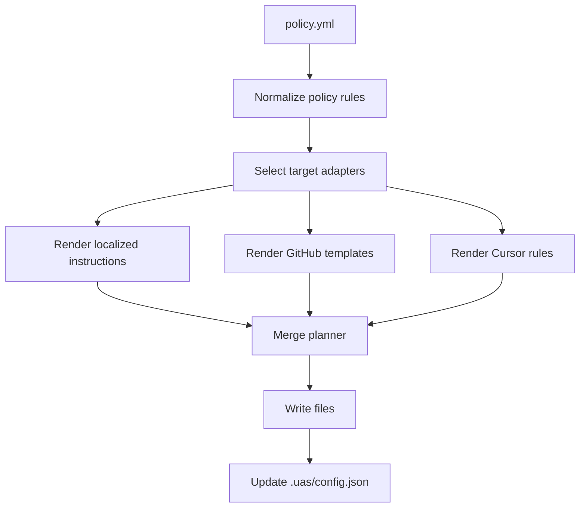

# Policy Pack Specification

Date: 2026-06-24  
Status: Draft for implementation  
Owner: Universal AI Skills Toolkit

## 1. Overview

A policy pack is declarative metadata that describes rules agents must follow. A policy is tool-agnostic. Adapters convert it into target-specific instructions such as `AGENTS.md`, `CLAUDE.md`, `GEMINI.md`, Cursor rules, GitHub Actions, templates, and manual setup guides.

Policy packs are not just copied files. They can guide behavior, generate checks, and feed `uas doctor` validation.

## 2. Goals

- Keep policy data independent from tool-specific output formats.
- Support both guidance and generated enforcement files.
- Map policy severity directly to CLI and doctor behavior.
- Generate safe files without silently overwriting existing user content.
- Allow future policy packs for security, clean code, deployment, and team workflow conventions.

## 3. Non-goals

- No GitHub API writes for branch protection or repository settings in MVP.
- No auto-fix in `uas doctor` for policy drift in MVP.
- No YAML semantic linting beyond generated file presence and marker integrity in MVP.
- No hidden destructive actions.

## 4. Directory Structure

```txt
packs/
  policies/
    github-collaboration/
      manifest.json
      policy.yml
      locales/
        ko/guideline.md
        en/guideline.md
      templates/
        github/
          pr-conventions.yml
          PULL_REQUEST_TEMPLATE.md
```

`manifest.json` describes marketplace metadata. `policy.yml` describes the canonical policy rules.

## 5. Policy Modes

| Mode | Meaning | MVP behavior |
| --- | --- | --- |
| `guidance` | Generates instruction text for agents. | Required |
| `generated-check` | Generates local files such as GitHub Actions or templates. | Required for simple workflows |
| `manual-setup` | Generates manual setup instructions for settings the CLI must not mutate. | Required |
| `external-enforced` | Uses external APIs to configure enforcement. | Out of scope for MVP |

`github-collaboration` should be `guidance` plus simple `generated-check` files. Protected branch setup must be documented as `manual-setup`.

## 6. Severity

Policy severity maps to CLI output and future CI behavior.

| Severity | Meaning | Doctor mapping |
| --- | --- | --- |
| `error` | Required rule. Missing generated files or broken markers should fail. | `fail` |
| `warn` | Strong recommendation. Missing files should warn. | `warn` |
| `info` | Documentation or optional practice. | `pass` with note |

Rule-level severity may override top-level severity.

## 7. `policy.yml` Schema

```yaml
slug: agile-branch-policy
version: 1.1.0
type: policy
name: Agile Branching & Commit Policy
severity: error
mode:
  - guidance
  - generated-check

language:
  default: ko
  commit_title: en
  pr_body: ko

rules:
  branching:
    severity: error
    pattern: "^(feature|bugfix|hotfix)/[A-Z]+-[0-9]+-[a-z0-9-]+$"
    protected_branches: ["main", "develop"]
    prevent_direct_push_to: ["main", "develop"]
    description:
      ko: "Jira 이슈 트래커 번호가 포함된 브랜치명을 사용해야 합니다."
      en: "Branch names must include a Jira issue key."

  commit:
    severity: error
    convention: conventional-commits
    require_issue_key: true

  pull_request:
    severity: warn
    title_convention: conventional-commits
    require_template: true
    require_human_review: true

  ci_cd:
    severity: warn
    required_checks: ["test-harness", "lint"]
    generated_workflows:
      - pr-conventions

guidelines:
  ko: "locales/ko/guideline.md"
  en: "locales/en/guideline.md"

outputs:
  instructions:
    - target: "AGENTS.md"
      adapter: "markdown-instruction"
    - target: "CLAUDE.md"
      adapter: "markdown-instruction"
    - target: "GEMINI.md"
      adapter: "markdown-instruction"
    - target: ".cursor/rules/agile-branch-policy.mdc"
      adapter: "cursor-rule"
  github:
    - target: ".github/workflows/pr-conventions.yml"
      adapter: "github-workflow"
    - target: ".github/PULL_REQUEST_TEMPLATE.md"
      adapter: "github-template"
    - target: ".github/CODEOWNERS"
      adapter: "github-template"
  manual:
    - target: "docs/github-branch-protection.md"
      adapter: "markdown-instruction"
```

## 8. Rule Groups

MVP policy schema should support these groups:

| Group | Purpose |
| --- | --- |
| `branching` | Branch name pattern, protected branches, direct-push guidance. |
| `commit` | Conventional Commits, issue key requirements, title language. |
| `pull_request` | PR title, template, review, body language, merge policy. |
| `ci_cd` | Generated checks, required checks, workflow template references. |
| `security` | Secret handling, OWASP guidance, dangerous action prohibitions. |
| `code_quality` | Clean code guidance, function length, dependency boundaries. |
| `deployment` | Deployment readiness, Kubernetes or Helm checks. |
| `agent_behavior` | Agent permissions, language, fallback, and escalation rules. |

Adapters may ignore unsupported rule groups but must report a warning during plan generation.

## 9. Tool-agnostic Policy Data

Policy files must not contain Claude, Codex, Cursor, or GitHub-specific prose as the source of truth. They may reference localized guideline files and template files, but target-specific formatting belongs in adapters.

For example:

- `policy.yml` defines `rules.branching.pattern`.
- GitHub adapter renders a workflow that checks the branch pattern.
- Cursor adapter renders `.cursor/rules/*.mdc`.
- Markdown instruction adapter renders `AGENTS.md`, `CLAUDE.md`, and `GEMINI.md` sections.

## 10. Generated Files

MVP policy generation supports:

```txt
AGENTS.md
CLAUDE.md
GEMINI.md
.cursor/rules/*.mdc
.github/workflows/*.yml
.github/PULL_REQUEST_TEMPLATE.md
.github/ISSUE_TEMPLATE/*.md
.github/CODEOWNERS
docs/*manual*.md
.uas/config.json
```

GitHub Actions generation should be limited to PR title and branch name checks in MVP.

## 11. GitHub Collaboration Policy

`policy:github-collaboration` should cover:

- Block direct commits to protected branches by instruction and generated manual setup guide.
- Generate PR title and branch name convention workflow.
- Generate PR template.
- Optionally generate issue template and CODEOWNERS.
- Require human approval before merge by instruction, not by GitHub API.
- Keep commit and PR titles in English Conventional Commits.
- Allow PR body and internal docs in Korean.

It must not:

- Change repository settings through the GitHub API.
- Enable auto-merge.
- Merge PRs.
- Force branch protection.

## 12. Seed Policy Packs

Required MVP policies:

| Slug | Purpose | Status |
| --- | --- | --- |
| `github-collaboration` | Branch, commit, PR, review, and generated GitHub convention files. | Required |
| `agent-instructions-basic` | Shared project rulebook for teams that need basic cross-agent instructions. | Required |

Recommended draft policies:

| Slug | Lifecycle stage | Purpose |
| --- | --- | --- |
| `security-by-design` | Design | Prevent hardcoded secrets and encode OWASP Top 10 guidance. |
| `clean-code-standard` | Build | Guide function length, dependency boundaries, and circular reference prevention. |
| `k8s-deployment-check` | Deploy | Check Helm chart syntax guidance and Kubernetes resource limit requirements. |

Draft policies may appear in the registry with lower trust score until examples and generated outputs are complete.

## 13. Conflict Model

Policy conflicts must be explicit in `manifest.json`.

Examples:

- Two policies define incompatible branch patterns.
- One policy requires squash merge while another requires merge commits.
- One policy requires issue keys and another forbids tracker-specific branch names.

The website should warn. The CLI should fail before write unless the user removes the conflict.

## 14. Doctor Rules

`uas doctor` should inspect installed policy state from `.uas/config.json`.

MVP checks:

- Installed policy exists in the current registry.
- Generated files exist.
- UAS marker blocks are present and intact.
- Marker metadata version matches `.uas/config.json`.
- Files listed as required by an `error` policy are not missing.

MVP does not parse the semantic contents of generated GitHub workflow YAML.

## 15. Policy Adapter Flow


