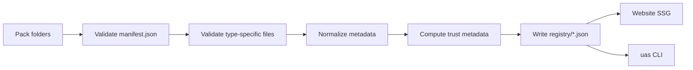

# Registry Schema and Meta-model Specification

Date: 2026-06-24  
Status: Draft for implementation  
Owner: Universal AI Skills Toolkit

## 1. Overview

The Marketplace MVP registry is a static JSON registry served by the website and consumed by the CLI. Its canonical source is not the built JSON file. The canonical source is each pack folder and its manifest.

The build pipeline collects pack manifests, validates them, normalizes them, enriches them with metadata such as trust score, and writes read-only registry artifacts under `registry/`.

The MVP must support a real install experience. The website can preview generated files at template level, but local diffing and file writes are CLI responsibilities.

## 2. Goals

- Provide one canonical metadata model for marketplace packs.
- Support static web hosting through build-time JSON artifacts.
- Keep localization first-class through `locales/<lang>/...`.
- Let the CLI install packs without requiring the website.
- Track compatibility, dependencies, conflicts, generated files, and trust signals.
- Keep version pinning in `.uas/config.json`, not in shareable stack URLs.

## 3. Non-goals

- No user accounts or private saved stacks in MVP.
- No live community submission workflow in MVP.
- No GitHub API writes for repo settings in MVP.
- No fully dynamic trust ranking in MVP.
- No marketplace payment or telemetry system.

## 4. Pack Types

The registry meta-model allows five pack types so the catalog can grow without a schema rewrite. The MVP install path only needs to be complete for `skill`, `policy`, and `collection`.

| Type | Purpose | MVP support |
| --- | --- | --- |
| `skill` | Prompt, context, examples, and optional scripts that help an agent perform a task. | Required |
| `policy` | Tool-agnostic rules an agent must follow or use as guidance. | Required |
| `persona` | System-level role, tone, authority, and operating boundaries. | Preview schema support |
| `workflow` | Automation templates such as GitHub Actions, PR templates, or CI/CD files. | Preview schema support; generated via policy adapters first |
| `collection` | Logical bundle of other packs. | Required |

## 5. Canonical Directory Structure

New marketplace packs should live under `packs/`. The existing `skills/` directory remains supported during migration and can be normalized into the registry build output.

```txt
packs/
  skills/
    tdd-harness-generator/
      manifest.json
      locales/
        ko/prompt.md
        en/prompt.md
        ja/prompt.md
      examples/
      reference/
      scripts/
  policies/
    agile-branch-policy/
      manifest.json
      policy.yml
      locales/
        ko/guideline.md
        en/guideline.md
  personas/
  workflows/
  collections/
registry/
  registry.json
  skills.json
  policies.json
  collections.json
schema/
  pack-metadata.schema.json
```

## 6. Build Flow



## 7. Pack Reference Format

Dependencies and conflicts must use a stable pack reference:

```txt
<type>:<slug>
```

Examples:

```txt
policy:clean-code-standard
skill:pr-commit-maker
collection:agile-devops-stack
```

If `type:` is omitted in user input, the CLI may resolve by unique slug. Ambiguous slugs must fail with a helpful error.

## 8. `manifest.json` Required Fields

Every pack must include:

```json
{
  "$schema": "../../schema/pack-metadata.schema.json",
  "slug": "tdd-harness-generator",
  "name": "TDD Harness Generator",
  "type": "skill",
  "version": "1.0.0",
  "status": "draft",
  "defaultLang": "ko",
  "description": {
    "ko": "애자일 방법론에 맞춘 TDD 테스트 하네스 코드를 자동 생성합니다.",
    "en": "Generates TDD test harness code tailored for Agile methodologies."
  },
  "summary": {
    "ko": "TDD 테스트 하네스 코드를 생성합니다.",
    "en": "Generate TDD test harness code."
  },
  "tags": ["testing", "agile", "tdd", "harness"],
  "compatibility": {
    "cursor": "native",
    "copilot": "instructions",
    "claude": "copy",
    "codex": "copy",
    "github-actions": "preview"
  },
  "risk": "code-generation",
  "dependencies": ["policy:clean-code-standard"],
  "conflictsWith": [],
  "files": [
    {
      "source": "locales/{lang}/prompt.md",
      "target": ".cursor/rules/tdd-{lang}.mdc",
      "adapter": "cursor-rule",
      "merge": "marker-append"
    }
  ]
}
```

## 9. Field Semantics

| Field | Requirement |
| --- | --- |
| `slug` | Lowercase kebab-case and unique within its type. |
| `name` | Human-readable display name. |
| `type` | One of `skill`, `policy`, `persona`, `workflow`, `collection`. |
| `version` | Semantic version, `MAJOR.MINOR.PATCH`. |
| `status` | One of `draft`, `beta`, `stable`, `deprecated`. |
| `defaultLang` | Default locale used when `--lang` is omitted and system locale is unsupported. |
| `description` | Localized detailed description. Must include `ko` and `en` for MVP seed packs. |
| `summary` | Localized short card summary. |
| `tags` | Search and filter tags. |
| `compatibility` | Target support map with modes below. |
| `risk` | One of `read-only`, `code-generation`, `file-write`, `network`, `credential-sensitive`. |
| `dependencies` | Required packs using `<type>:<slug>`. |
| `conflictsWith` | Mutually exclusive packs using `<type>:<slug>`. |
| `files` | Adapter input/output declarations. |

## 10. Compatibility Modes

| Mode | Meaning |
| --- | --- |
| `native` | Target can consume the generated file directly. |
| `copy` | Target can use prompt/instruction content through copy or generic markdown. |
| `instructions` | Target receives instruction text, but not a native skill format. |
| `preview` | Schema support exists, but install behavior is partial or experimental. |
| `unsupported` | Target is known not to be supported. |

## 11. Locale Rules

MVP seed packs should include `ko` and `en`. Japanese (`ja`) is supported by schema and should be treated as first-class when present.

Localized files must live under:

```txt
locales/<lang>/<file>
```

Template paths may use `{lang}`. The CLI resolves `{lang}` from `--lang`, system locale, or `defaultLang`.

## 12. File Declaration Model

Each file declaration describes how source content becomes a project file.

```json
{
  "source": "locales/{lang}/prompt.md",
  "target": ".cursor/rules/tdd-{lang}.mdc",
  "adapter": "cursor-rule",
  "merge": "marker-append",
  "required": true
}
```

Supported MVP adapters:

| Adapter | Purpose |
| --- | --- |
| `markdown-instruction` | Append or update marked sections in `AGENTS.md`, `CLAUDE.md`, or `GEMINI.md`. |
| `cursor-rule` | Generate `.cursor/rules/*.mdc` with frontmatter. |
| `claude-skill` | Copy skill package into `.claude/skills/<slug>/`. |
| `codex-skill` | Copy skill package into `.codex/skills/<slug>/`. |
| `github-workflow` | Generate `.github/workflows/*.yml`. |
| `github-template` | Generate PR, issue, or CODEOWNERS templates. |
| `uas-state` | Write `.uas/config.json`. |

Supported merge strategies:

| Strategy | Behavior |
| --- | --- |
| `marker-append` | Append a UAS marker block if none exists, replace marker block if it exists. |
| `copy-dir` | Copy a directory tree for tool-native skill packs. |
| `create-only` | Create file if missing; conflict if present. |
| `overwrite` | Replace the file only after explicit confirmation. |
| `skip` | Never write; preview only. |

## 13. Collection Manifests

A collection is a bundle of pack references. In MVP, a collection must not define its own generated files or conflict logic. It inherits dependencies and conflicts from included packs.

```json
{
  "$schema": "../../schema/pack-metadata.schema.json",
  "slug": "agile-devops-stack",
  "name": "Agile DevOps Stack",
  "type": "collection",
  "version": "1.0.0",
  "status": "draft",
  "defaultLang": "ko",
  "description": {
    "ko": "애자일 개발과 배포를 위한 기본 스택입니다.",
    "en": "A starter stack for agile development and deployment."
  },
  "summary": {
    "ko": "애자일 개발 기본 스택",
    "en": "Agile development starter stack"
  },
  "tags": ["agile", "devops"],
  "compatibility": {
    "cursor": "native",
    "github-actions": "native"
  },
  "risk": "file-write",
  "includes": [
    "policy:github-collaboration",
    "skill:pr-commit-maker",
    "skill:project-dashboard"
  ]
}
```

## 14. Built Registry Artifacts

`registry/*.json` files are generated and should be treated as read-only artifacts. The website and CLI should consume these files instead of scanning pack folders at runtime.

Top-level `registry/registry.json`:

```json
{
  "schemaVersion": "1.0.0",
  "generatedAt": "2026-06-24T00:00:00.000Z",
  "packs": [
    {
      "ref": "skill:tdd-harness-generator",
      "slug": "tdd-harness-generator",
      "type": "skill",
      "name": "TDD Harness Generator",
      "version": "1.0.0",
      "status": "draft",
      "trust": {
        "score": 82,
        "source": "manual",
        "updatedAt": "2026-06-24"
      }
    }
  ]
}
```

Type-specific artifacts such as `registry/skills.json` and `registry/policies.json` may be written for simpler frontend loading.

## 15. Trust Score

Trust score is a 0-100 score surfaced in the website and CLI.

For MVP, trust score may be static metadata from the manifest or build config:

```json
{
  "trust": {
    "score": 88,
    "source": "manual",
    "updatedAt": "2026-06-24",
    "notes": "Seed pack reviewed by maintainer."
  }
}
```

The registry builder must still emit `trust.score` in the built artifact so the website and CLI do not need to know whether it was manual or computed.

Post-MVP dynamic scoring can use:

```txt
S = (A * 0.4) + (B * 0.3) + (C * 0.3)
```

| Component | Meaning |
| --- | --- |
| `A` Freshness | 100 if updated within 30 days, then decreases over time. |
| `B` Completeness | Required fields, required locales, examples, and file declarations. |
| `C` Community/Source | Stars, issue resolution time, source verification, or maintainer review. |

External GitHub API enrichment is explicitly post-MVP.

## 16. MVP Seed Packs

Required MVP seed packs:

- `skill:ai-handoff`
- `skill:readme-architect`
- `skill:pr-commit-maker`
- `skill:github-workflow`
- `skill:project-dashboard`
- `policy:github-collaboration`
- `policy:agent-instructions-basic`

Recommended policy seed candidates that may ship as `draft`:

- `policy:security-by-design`
- `policy:clean-code-standard`
- `policy:k8s-deployment-check`

## 17. Validation Rules

The registry build must fail when:

- A manifest is missing required fields.
- `slug` does not match its folder name.
- A dependency or conflict points to a missing pack.
- A file declaration source path does not exist.
- A target path escapes the project root.
- A collection includes itself directly or transitively.
- A locale referenced by `defaultLang` is missing.

The build should warn when:

- A pack has no examples.
- A non-MVP locale is incomplete.
- Compatibility is `preview` for a requested target.
- Trust score source is older than 90 days.

## 18. Open Implementation Notes

- Existing `skills/<slug>/metadata.json` files should be normalized into this model before moving files.
- Stack URLs should contain slugs only in MVP: `?s=github-workflow,github-collaboration`.
- `.uas/config.json` is responsible for version pinning and generated file ownership.
