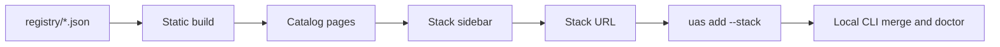
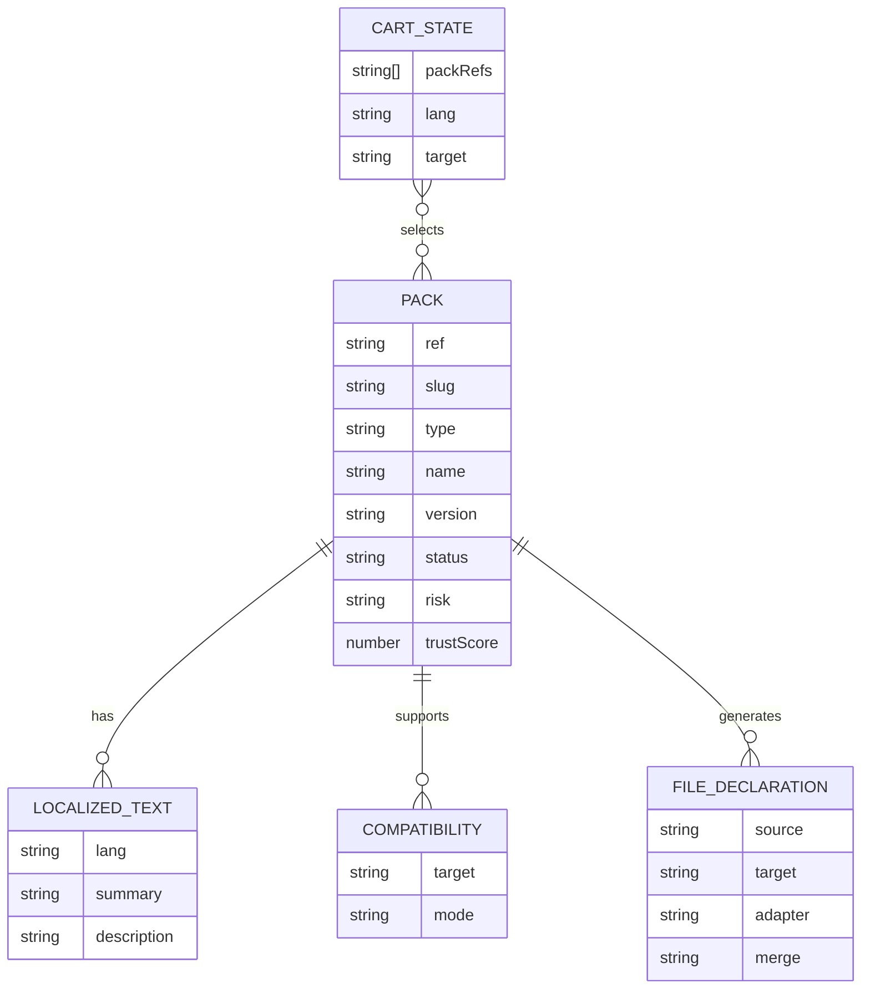

# Website Data Model and UX Specification

Date: 2026-06-24  
Status: Draft for implementation  
Owner: Universal AI Skills Toolkit

## 1. Overview

The marketplace website is a static app generated from built registry JSON artifacts. It combines app-store discovery with an e-commerce cart flow: users browse packs, add them to a stack, inspect raw files, see conflicts, and copy a CLI install command.

The website does not inspect a user's local project. Local file diffing and merging are CLI responsibilities.

## 2. Architecture

- Framework target: Next.js Static Site Generation or a static React app.
- Data source: built `registry/*.json` artifacts.
- Runtime storage: browser state for cart and preferences.
- Install handoff: generated `uas add --stack <URL>` command.



## 3. Core Routes

| Route | Purpose |
| --- | --- |
| `/` | App-like marketplace with search, filters, cards, and stack sidebar. |
| `/skills` | Skill pack catalog. |
| `/skills/[slug]` | Skill detail with raw file preview. |
| `/policies` | Policy pack catalog. |
| `/policies/[slug]` | Policy detail with rules, generated outputs, and preview. |
| `/collections/[slug]` | Collection detail showing included packs. |
| `/stack` | Shareable stack preview and command generation. |
| `/docs` | CLI, registry, adapter, and contribution documentation. |
| `/submit` | Contribution guide only; no live submission UI in MVP. |

## 4. Core UX Flows

### A. Browse and Filter

The first viewport should be a usable tool, not a marketing page.

Required filters:

- Type: skill, policy, persona, workflow, collection.
- Tags: Agile, CI/CD, testing, docs, security, deployment.
- Target: Cursor, Claude, Codex, Gemini, GitHub.
- Risk.
- Status.
- Minimum trust score.

Card UI must show:

- Name.
- Slug.
- Type icon.
- Summary.
- Trust score badge.
- Compatibility badges.
- Risk label.
- Add to Stack button.

### B. Detail Page

Detail pages must provide transparency before install.

Required sections:

- Description and summary.
- Compatibility matrix.
- Dependencies and conflicts.
- Generated file list.
- Trust score and source.
- Raw file preview.
- Install command.

Raw file preview:

- Language switcher for `ko`, `en`, `ja` when available.
- No full page reload for language switching.
- IDE-style code block viewer.
- Show actual source templates declared in `manifest.json`, such as markdown, `.mdc`, and `.yml`.

### C. Stack Builder

Users can add packs from cards or detail pages. The stack sidebar should show:

- Selected packs.
- Expanded collection contents.
- Missing dependencies.
- Conflicts.
- Combined compatibility by target.
- Generated file count.
- Selected language.
- Selected target.
- Share URL.
- Generated command.

Conflict behavior:

- Website warns but does not resolve conflicts.
- CLI performs authoritative conflict resolution during `uas add`.

### D. Share and Install

MVP stack URL:

```txt
https://universal-ai-skills.dev/stack?s=github-workflow,github-collaboration
```

The generated command:

```bash
uas add --stack "https://universal-ai-skills.dev/stack?s=github-workflow,github-collaboration"
```

The URL should contain slugs only. Target, language, and version pins are selected in the CLI or stored in `.uas/config.json`.

## 5. Data Entities



## 6. Pack Entity

Frontend-normalized pack shape:

```ts
type PackType = "skill" | "policy" | "persona" | "workflow" | "collection";
type CompatibilityMode = "native" | "copy" | "instructions" | "preview" | "unsupported";

interface Pack {
  ref: string;
  slug: string;
  type: PackType;
  name: string;
  version: string;
  status: "draft" | "beta" | "stable" | "deprecated";
  summary: Record<string, string>;
  description: Record<string, string>;
  category?: string;
  tags: string[];
  risk: "read-only" | "code-generation" | "file-write" | "network" | "credential-sensitive";
  compatibility: Record<string, CompatibilityMode>;
  dependencies: string[];
  conflictsWith: string[];
  files: FileDeclaration[];
  trust: TrustMetadata;
  includes?: string[];
  sourceUrl?: string;
  updatedAt?: string;
}
```

## 7. Cart State

```ts
interface CartState {
  packRefs: string[];
  lang: "ko" | "en" | "ja" | string;
  target: "all" | "cursor" | "claude" | "codex" | "gemini" | "github";
}
```

The cart should persist to URL or local storage for convenience, but the shareable stack URL must remain slug-only in MVP.

## 8. Generated Preview Model

The website preview is template-level only.

```ts
interface GeneratedPreview {
  packRef: string;
  targetPath: string;
  adapter: string;
  lang: string;
  contentPreview: string;
}
```

It must not claim to know whether a user's local file will be created, merged, skipped, or overwritten. That decision belongs to the CLI.

## 9. Conflict Model

```ts
interface ConflictWarning {
  severity: "warn" | "error";
  packRefs: string[];
  message: Record<string, string>;
  reason: "declared-conflict" | "missing-dependency" | "unsupported-target";
}
```

Website conflict rules:

- Declared conflicts between selected packs are `error`.
- Missing dependencies are `warn` if the CLI can auto-add them, otherwise `error`.
- Unsupported target is `warn` when another target remains supported.
- Collection conflicts are inherited from included packs.

## 10. Trust Badge

The website should display trust score exactly as emitted by the registry artifact.

Badge levels:

| Score | Label |
| --- | --- |
| `90-100` | High trust |
| `70-89` | Reviewed |
| `40-69` | Draft |
| `0-39` | Experimental |

The badge should show the score source when available, such as `manual` or `build`.

## 11. Search Index Fields

Search should index:

- `slug`
- `name`
- localized `summary`
- localized `description`
- `tags`
- `type`
- `risk`
- `compatibility` target names

## 12. Accessibility and UX Requirements

- Filters must be keyboard accessible.
- Add/remove stack actions must have text labels or accessible labels.
- Raw file preview must be readable without relying on color alone.
- Stack conflict warnings must be visible before command copy.
- Generated command must be copyable with one click.

## 13. MVP Non-goals

- No login.
- No private stack saving.
- No live pack submission form.
- No local filesystem diffing in browser.
- No dynamic trust score recomputation in the browser.
